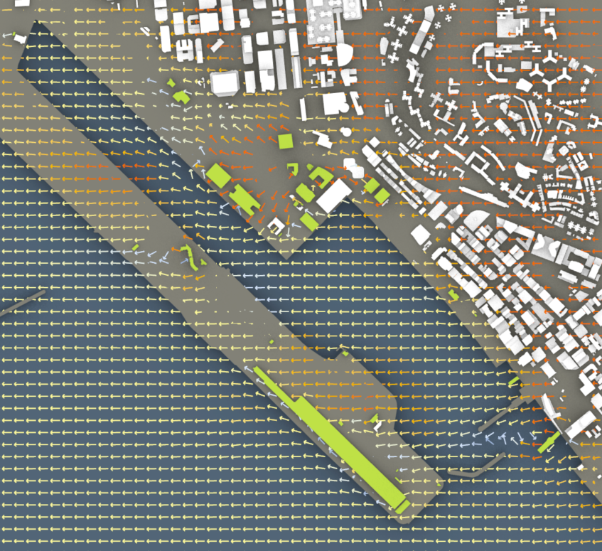
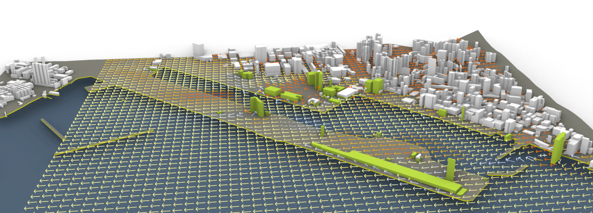

# Kowloon_Bay_blueCFD
Wind simulation using Butterfly CFD Grasshopper tools.

  

  

## Grasshopper Dependencies
The grasshopper code uses the following third party plugins:
- [Elk2](https://www.food4rhino.com/en/app/elk), Version=1.0.0.0
- [Ladybug Tools](https://www.food4rhino.com/en/app/ladybug-tools), Version=1.2.0
- [Butterfly](https://www.food4rhino.com/en/app/ladybug-tools), Version=0.0.05

## blueCFD Core (OpenFOAM) Installation
Run the blueCFD-Core executable, which is downloadable from [this page](http://bluecfd.github.io/Core/Downloads/#bluecfd-core-2017-2).
Then, right-click on the "blueCFD-Core terminal" shortcut and select "Run as administrator". A terminal will pop up and a series of commands will run.
Once the the command reads "Environment is ready", it would be safe to close out of the terminal and blueCFD-Core would then be successfully installed on your machine!

## References
- [Ladybug Tools Butterfly](https://www.ladybug.tools/butterfly.html).
- [Butterfly Github Repository](https://arxiv.org/abs/1707.06347).
- [Butterfly Documentation](https://www.ladybug.tools/butterfly/docs/).
